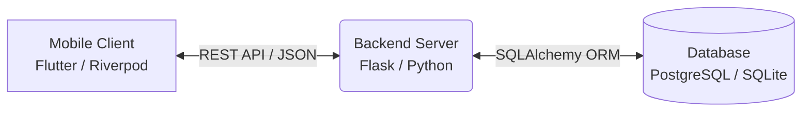

# YouthFinance

**A financial wellness and goal-planning platform built on the principle of controlled money allocation.**

YouthFinance is a full-stack application designed to help users deliberately allocate and manage their money. Rather than passively tracking expenses, it requires users to define where their available money should go — into monthly budgets, long-term goals, emergency savings, or discretionary "Fun Funds" — and then expenses are drawn against these allocated buckets.

---

## Overview

Traditional finance applications focus on recording where money *went*. YouthFinance shifts the paradigm by focusing on where money *should go*.

The platform implements a **Controlled Money** model:

1. **Income** creates new available money, initially placed in a General pool.
2. Users **allocate** that money into specific buckets: Budgets, Goals, Emergency Funds, or Fun Funds. These are internal transfers — the total controlled money remains unchanged.
3. **Expenses** remove money from the system by debiting the appropriate bucket. For regular expenses, the deduction priority is: **Budget → General → Goal → Emergency**. Fun Fund expenses are explicit and deduct only from the specified Fun Fund.

This model ensures users remain aware of the consequences of their spending decisions and maintain proactive control over their cash flow.

---

## Core Capabilities

- **Income & Expense Tracking** — Log external financial events that add to or subtract from your controlled money pool.
- **Budgeting System** — Set categorical spending limits per month.
- **Goal Planning** — Create long-term savings targets with deadlines and track progress.
- **Emergency Fund** — Build and maintain a safety net with dedicated bucket tracking.
- **Fun Funds** — Carve out consequence-free discretionary money from monthly budgets (up to 2 active funds, max 50% of parent budget). Supports cancellation (funds return to budget) and completion (remaining balance becomes an expense).
- **Financial Health Score** — Composite score based on savings rate, budget discipline, goal progress, income stability, expense stability, emergency coverage, investment activity, and Fun Fund usage.
- **Analytics & Insights** — Spending patterns, cash flow trends, future projections, and financial reflections.
- **Learning Hub** — Curated financial literacy content including videos and articles.
- **Investments** — Track external assets separately from controlled money.
- **Notifications** — Configurable alerts for budget limits, goal milestones, and system events.
- **Authentication** — JWT-based auth with secure token storage and user profile management.

---

## Architecture

### High-Level System Design



### Frontend

- **Framework:** Flutter
- **State Management:** Riverpod
- **Routing:** GoRouter
- **Networking:** Dio
- **Architecture:** Feature-based organization (`lib/features/`)

### Backend

- **Framework:** Flask
- **ORM:** SQLAlchemy
- **Migrations:** Alembic via Flask-Migrate
- **Authentication:** JWT (Flask-JWT-Extended)
- **Architecture:** Modular domain structure (`app/modules/` and `app/analytics/`)

### Database

The financial model relies on a specialized `money_allocations` ledger table that distinguishes between actual external money movement and internal allocation logic.

Key entities:
- **Users** — authentication and profile data
- **Incomes / Expenses** — external financial events
- **Budgets / Goals / Fun Funds** — allocation targets and limits
- **Money Allocations** — the internal ledger recording every bucket movement
- **Savings / Investments / Notifications** — supporting records

> For the complete data model, see [docs/DATABASE.md](docs/DATABASE.md).

---

## Request Lifecycle

1. **User Action** — A Flutter screen triggers a state change.
2. **Provider / Service** — A Riverpod provider calls the repository layer.
3. **API Client** — Dio sends an authenticated HTTP request to the backend.
4. **Backend Route** — Flask validates JWT identity and delegates to the service layer.
5. **Service Layer** — Business logic executes (e.g., allocation rules, scoring).
6. **Database** — SQLAlchemy persists or retrieves data.
7. **Response** — JSON is returned to the client.
8. **UI Update** — Riverpod refreshes state and the UI updates reactively.

---

## Project Structure

```
youthfinance/
├── backend/
│   ├── app/
│   │   ├── modules/           # Domain modules
│   │   │   ├── auth/
│   │   │   ├── income/
│   │   │   ├── expense/
│   │   │   ├── budget/
│   │   │   ├── goal/
│   │   │   ├── savings/
│   │   │   ├── fun_fund/
│   │   │   ├── emergency/
│   │   │   ├── investment/
│   │   │   └── notification/
│   │   ├── analytics/         # Scoring and insights
│   │   │   ├── dashboard/
│   │   │   ├── financial_health/
│   │   │   ├── spending_analysis/
│   │   │   ├── goal_readiness/
│   │   │   └── financial_planner/
│   │   ├── common/            # Shared utilities and error handling
│   │   ├── config/            # Application configuration
│   │   └── models/            # Base models
│   ├── migrations/            # Alembic migration scripts
│   ├── tests/                 # Backend tests
│   ├── run.py                 # Entry point
│   └── requirements.txt       # Python dependencies
│
├── frontend/
│   └── lib/
│       └── features/
│           ├── auth/
│           ├── home/
│           ├── transactions/
│           ├── budget/
│           ├── goals/
│           ├── savings/
│           ├── fun_fund/
│           ├── emergency/
│           ├── investment/
│           ├── analytics/
│           ├── learning/
│           ├── notifications/
│           ├── profile/
│           ├── splash/
│           └── shell/
│
└── docs/
    ├── ARCHITECTURE.md
    ├── DATABASE.md
    ├── FEATURES.md
    └── DEVELOPMENT.md
```

---

## API Reference

The backend exposes modular REST endpoints:

| Endpoint | Purpose |
|----------|---------|
| `/api/auth` | Registration, login, profile |
| `/api/income` | Log income events |
| `/api/expense` | Record expenses |
| `/api/budget` | Manage monthly budgets |
| `/api/goal` | Create and track goals |
| `/api/savings` | Record goal contributions |
| `/api/fun-fund` | Manage discretionary funds |
| `/api/emergency` | Emergency fund operations |
| `/api/investment` | Track investments |
| `/api/notification` | Alerts and preferences |
| `/api/dashboard` | Aggregated financial summary |
| `/api/financial-health` | Health score and breakdown |
| `/api/analysis` | Spending patterns |
| `/api/planner` | Financial projections |

All endpoints except authentication require a valid JWT token.

---

## Getting Started

### Prerequisites

- Python 3.10+
- Flutter 3.12+
- PostgreSQL or SQLite

### Backend

```bash
cd backend
python -m venv .venv
.venv\Scripts\activate   # Windows
source .venv/bin/activate # macOS/Linux
pip install -r requirements.txt
cp .env.example .env
flask db upgrade
python run.py
```

Server runs at `http://localhost:5000`.

### Frontend

```bash
cd frontend
flutter pub get
flutter pub run build_runner build --delete-conflicting-outputs
flutter run
```

---

## Development Guidelines

- Do not modify database records directly outside the application logic. The `money_allocations` ledger must stay consistent.
- Do not commit secrets or environment files.
- Run `flask db migrate` and `flask db upgrade` for schema changes.
- Invalidate Riverpod providers after mutations to keep the UI synchronized.

---

## Documentation

- [ARCHITECTURE.md](docs/ARCHITECTURE.md) — System design and money flow
- [DATABASE.md](docs/DATABASE.md) — Data model and schema
- [FEATURES.md](docs/FEATURES.md) — Product behavior and rules
- [DEVELOPMENT.md](docs/DEVELOPMENT.md) — Setup and contribution guide
