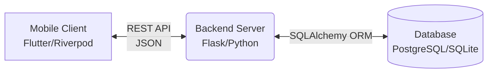
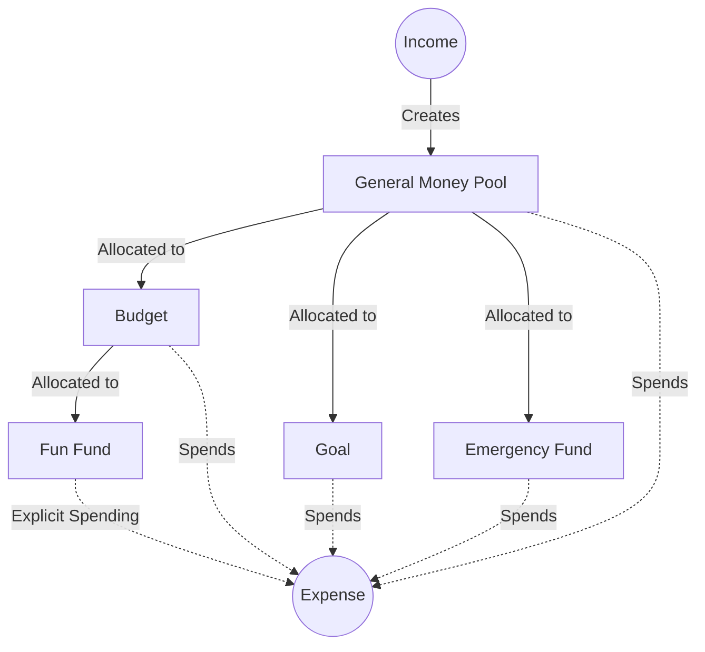

# System Architecture

This document describes the high-level architecture and implementation details of the YouthFinance application. It outlines the technology stack, the request lifecycle, and the core conceptual model for how money flows through the system.

## High-Level Architecture

YouthFinance follows a standard client-server architecture with a mobile-first frontend communicating via REST API to a Python backend, which persists data in a relational database.

### 1. Frontend (Mobile Client)
- **Framework:** Flutter
- **State Management:** Riverpod
- **Routing:** GoRouter
- **Networking:** Dio
- **Architecture Style:** Feature-based organization (`lib/features/`)

### 2. Backend (Server)
- **Framework:** Flask
- **ORM:** SQLAlchemy
- **Authentication:** JWT (JSON Web Tokens)
- **Architecture Style:** Module-based organization (`app/modules/`)

### 3. Database
- **Engine:** PostgreSQL or SQLite (depending on environment)
- **Migrations:** Alembic (Flask-Migrate)

## Request Lifecycle

When a user interacts with the application, the request follows a predictable path:

1. **User Action:** The user performs an action on a Flutter screen (e.g., adding an expense).
2. **State/Provider:** A Riverpod provider triggers a service call.
3. **API Client:** Dio sends an HTTP request with a JWT token to the backend.
4. **Backend Route:** The Flask route receives the request and validates the JWT identity.
5. **Service Layer:** Business logic is executed in the corresponding service (e.g., `MoneyService`, `ExpenseService`).
6. **Database:** SQLAlchemy persists or retrieves data.
7. **Response:** The backend returns JSON.
8. **UI Update:** Riverpod updates the local state, which reactively updates the UI.

## Core Financial Architecture

YouthFinance uses a specialized conceptual model for money management. It is not merely a ledger of transactions; it is a system of **Controlled Money**.

### The Allocation Model

The most critical architectural component is the `MoneyAllocation` model, managed by `MoneyService`. This model distinguishes between actual external transactions (Income/Expenses) and internal money movements (Allocations).

#### Rules of Controlled Money

1. **Income Creates Money:** Only recording an `Income` adds new money to the overall system. By default, this money goes to General savings.
2. **Allocation Moves Money:** When money is assigned to a Goal, Budget, or Emergency Fund, it is simply an internal transfer (`amount` is moved from General to the specific bucket). The total amount of money does not change.
3. **Expense Removes Money:** Spending money creates an `Expense` record and debits a corresponding bucket.
   - Normal expenses automatically withdraw from buckets in the following priority: Budget → General → Goal → Emergency.
   - "Fun Fund" expenses are explicit and deduct only from the specified Fun Fund.

#### The Fun Fund Lifecycle

The Fun Fund has a special architectural lifecycle designed to control discretionary spending.

- **Creation:** A Fun Fund is created using a portion of the current month's Budget (max 50%). Money is allocated from the Budget to the Fun Fund bucket.
- **Cancellation:** If cancelled, the remaining money in the Fun Fund bucket is **Released** back to the Budget. It is not considered spent.
- **Completion (Finishing):** If finished, the remaining money is assumed to have been spent. The money is removed from controlled money, and an **Expense** is created for the remaining balance.

### Modular Backend Structure

The backend separates concerns into domains:

- `auth`: User registration, login, and profile.
- `money`: Core allocation ledger and bucket calculations (`money_service.py`).
- `budget`: Monthly categorical spending limits.
- `expense`: Tracking money leaving the system.
- `income`: Tracking new money entering the system.
- `goal`: Saving targets with deadlines.
- `savings`: Historical tracking of manual savings inputs.
- `fun_fund`: Discretionary micro-budgets carved out of a primary Budget.
- `investment`: Simple tracking of external investment values.
- `notification`: In-app alerts and preference management.

Each domain typically contains its own `model.py`, `service.py`, and API routes, avoiding monolith controller files.
