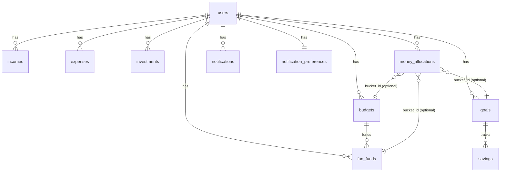

# Database Documentation

This document provides a conceptual overview of the YouthFinance database schema. The database is relational and models the flow of controlled money within the system.

## Conceptual Data Model

The core of the database revolves around the user, their external financial transactions (incomes, expenses), and their internal allocations of money.

## Core Entities

### 1. User Management
- **`users`**: Stores user authentication and profile details (`full_name`, `email`, `password_hash`, `age`, `gender`, `region`, `occupation`).

### 2. External Transactions
These tables represent money entering or leaving the user's possession.
- **`incomes`**: Records new money entering the system. Contains `source`, `amount`, `date`, and `description`. Incomes increase the overall amount of controlled money.
- **`expenses`**: Records money leaving the system. Contains `category`, `amount`, `date`, and `description`. Expenses decrease the overall amount of controlled money.

### 3. Financial Buckets (Controlled Money)
These tables define specific targets or limits for money allocation. They do not hold money directly; instead, their balances are calculated from the `money_allocations` ledger.
- **`budgets`**: Defines monthly spending limits for categories (`category`, `amount`, `month`, `year`).
- **`goals`**: Defines long-term saving targets (`title`, `target_amount`, `current_amount`, `target_date`, `is_completed`). Note: The `current_amount` and `is_completed` fields are cached values synchronized from the ledger.
- **`fun_funds`**: Discretionary spending allocations tied to a parent budget (`budget_id`, `title`, `target_amount`, `current_amount`, `target_date`).
- **`investments`**: External asset tracking (`name`, `symbol`, `amount_invested`, `current_value`, `date_invested`). This table is separate from controlled money.

### 4. The Money Ledger
- **`money_allocations`**: The most important table for understanding the financial model. It records every internal movement or controlled-money adjustment.
  - **`bucket_type`**: The area whose balance changes (`general`, `goal`, `emergency`, `budget`, `fun_fund`).
  - **`bucket_id`**: The ID of the related bucket (e.g., the specific goal or budget ID). This is a soft reference, not a strict foreign key, allowing it to point to different tables.
  - **`amount`**: The value added or removed (positive/negative).
  - **`entry_type`**: The nature of the entry (`allocation`, `release`, `expense`, `income`, `adjustment`).
  - **`reference_type` / `reference_id`**: Audit references indicating which event caused the entry (e.g., an expense ID or a goal ID).

### 5. Utilities
- **`savings`**: Historical records of money added to goals. These generate corresponding internal allocations in the `money_allocations` table.
- **`notifications`**: Stores system and user alerts (`type`, `title`, `message`, `is_read`).
- **`notification_preferences`**: Stores user toggles for different notification types.

## Database Migrations

The database schema is managed using **Alembic** via Flask-Migrate. 
The `alembic_version` table keeps track of the currently applied migration. Migration scripts define the exact DDL commands to create and alter these tables over time.
